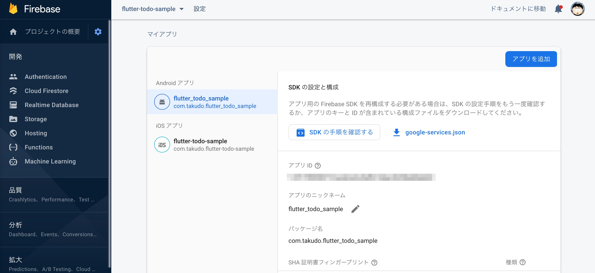
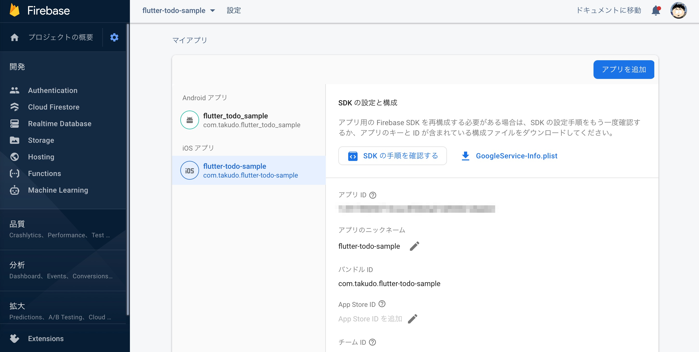
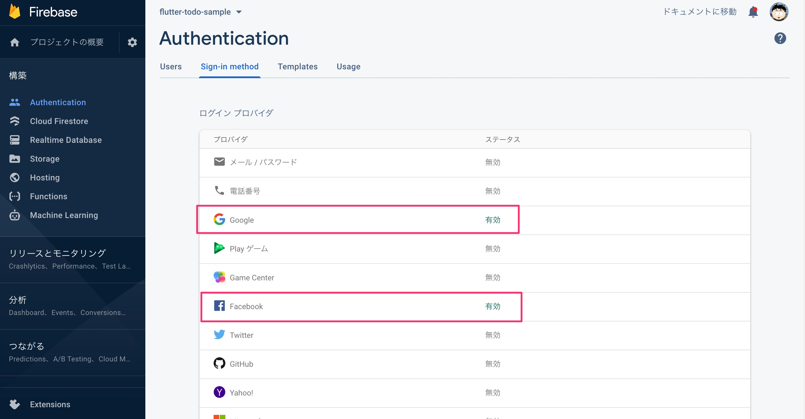
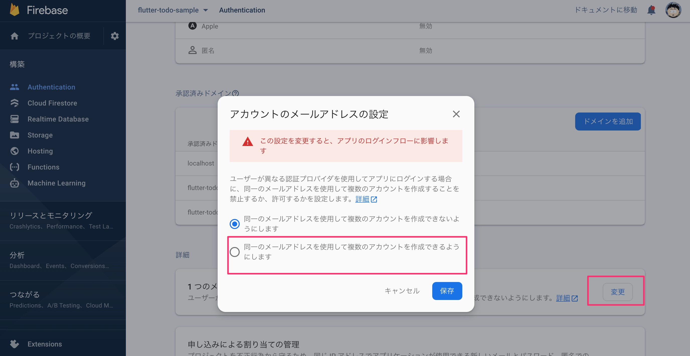

# flutter_todo_sample

flutter を用いて、以下の実装を試したサンプルアプリケーションです

## Features

- [x] sns ログイン
    - facebook
    - google
- [x] タスクの一覧表示
    - [ ] ステータス別のフィルタリング表示（すべて/未完了のみ/完了のみ）
- [x] タスクの新規追加
- [x] タスクの更新
- [x] タスクの削除
- [x] タスクのステータス変更（完了/未完了）
- [ ] タスクの並び替え

## 開発環境の設定

### Firebase の Authentication

- Firebase の設定ファイルは自身で作成したものを配置してください
    - android: `google-services.json` を `android/app/` 配下に配置
    
    - ios: `google-services.json` を `android/app/` 配下に配置
    

- ログインプロバイダの、 Facebook と Google の有効化
  - 設定
    
  - マルチログインの有効化
    